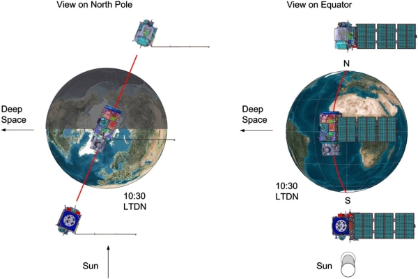
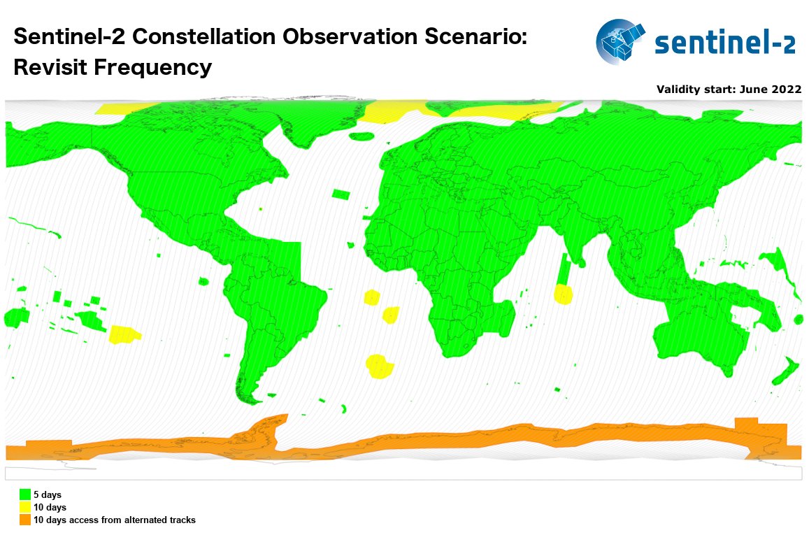
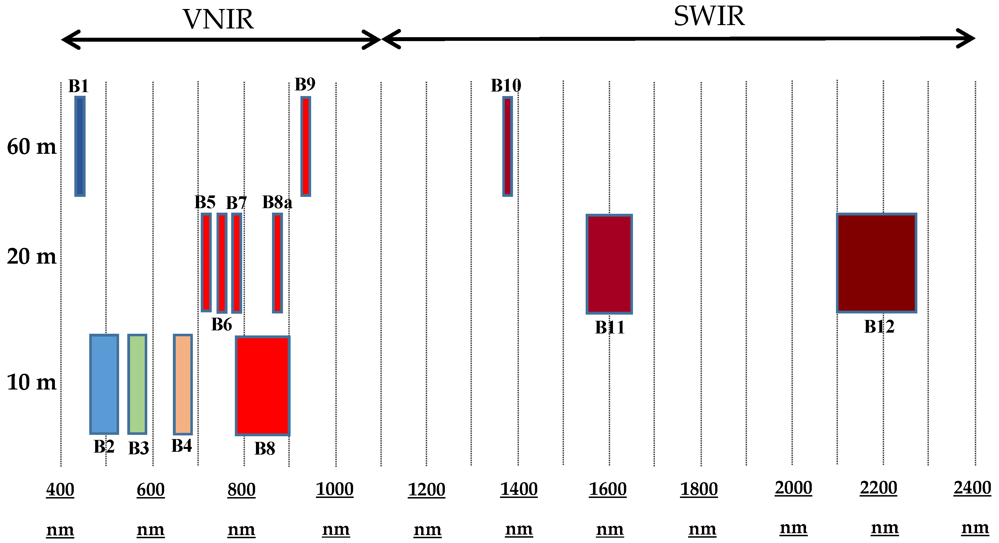
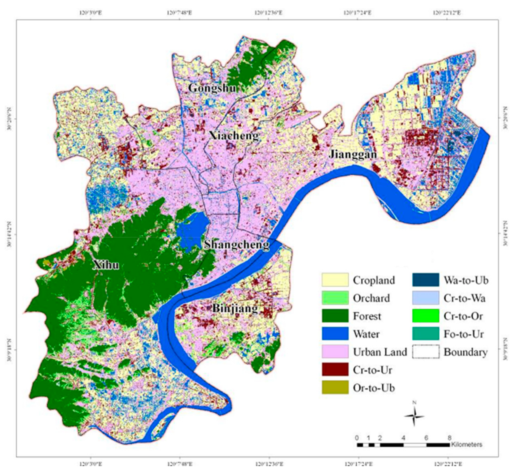
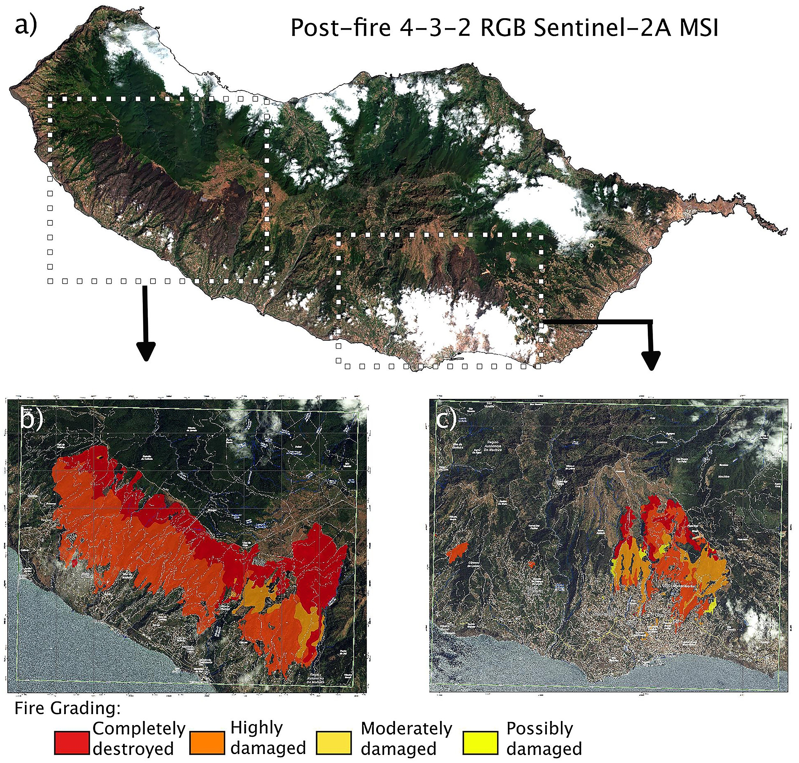
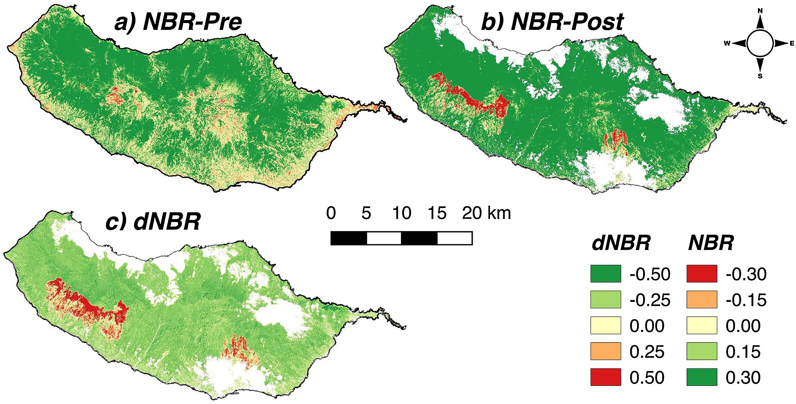

```{r xaringan-themer, include=FALSE, warning=FALSE}
library(xaringanthemer)
style_mono_accent(
  base_color = "#47B5A4",
  header_font_google = google_font("Josefin Sans"),
  text_font_google   = google_font("Montserrat", "300", "300i"),
  code_font_google   = google_font("Fira Mono")
)

```

```{r echo=FALSE}
library(RefManageR)
BibOptions(check.entries = FALSE,
           bib.style = "authoryear",
           cite.style = "authoryear",
           style = "markdown",
           hyperlink = TRUE,
           dashed = FALSE,
           no.print.fields=c("doi", "url", "urldate", "issn"))
myBib <- ReadBib("/Users/chenfen/Desktop/CASA/CASA0023 RSCE/0023_pratical_project/bib/test_QM.bib", check = FALSE)
```
class: inverse,bottom,left
background-image: url(img/Sentinel-2-infographic.png)
background-size: cover

<p style="position: absolute; bottom:25px; left:35px; color: white; font-size: 15px; font-weight: bold;">Figure 1: The Basic Information of Sentinel-2</p>
</div>
<p style="position: absolute; bottom:5px; left:35px; color: white; font-size: 15px; font-weight: bold;"> Picture from: [ESA(no date)](https://sentinels.copernicus.eu/web/sentinel/missions/sentinel-2)</p>
</div>
---
class: inverse,top, left
background-image: url(img/Figure02.png)
background-size:cover

<p style="position: absolute; top: 20px; left: 35px; color:#47B5A4; font-size: 28px; font-weight: bold;"> What distinguishes Sentinel-2 from other Sentinel satellites ?</p>
</div>


<p style="position: absolute; bottom:0px; left:35px; color: white; font-size: 15px; font-weight: bold;"> Figure 2: Sentinel Family, source from: [ESA(no date)](https://sentinels.copernicus.eu/web/sentinel/missions) and [Breeze Technologies(2020)](https://www.breeze-technologies.de/blog/different-esa-copernicus-sentinel-missions-and-what-they-measure/)</p>
</div>
---
## Operational Information

.pull-left[
**Two Identical Satellites**: 
- Sentinel-2A and Sentinel-2. 
<br/>

**Orbital Information **: 
- **Type**: <br/>sun-synchronous orbits
- **Operational mode**:<br/>
the two satellites occupy <br/>
the same orbits separated <br/> 
by 180 degrees 
- **Altitude**: 786 km
- **Inclination**: 98.62 deg
- **Period**: 100.6 min
- **Cycle**: 10 days
]




<p style="position: absolute; bottom: 60px; right: 10px; color: black; font-size: 15px; font-weight: bold;"> Figure 3: [The Twin-Satellite Sentinel-2 Orbital Configuration](https://sentiwiki.copernicus.eu/web/s2-mission)</p>
</div>

---
## Geographical Coverage
</div>
The Sentinel-2 will cover the following areas: <br/>
.pull-left[
- all continental land surfaces (including inland waters) between latitudes 56° South <br/> and 82.8° North.
- all coastal waters up to 20 km from the shore.
- all islands greater than 100 km2.
- all EU islands.
- the Mediterranean Sea.
- all closed seas (e.g. Caspian Sea).]



<p style="position: absolute; bottom: 120px; right: 10px; color: black; font-size: 15px; font-weight: bold;"> Figure 4 : [The Coverage and Revisit Time Foreseen of Sentinel -2](https://sentiwiki.copernicus.eu/web/s2-mission)</p>
</div>
---
## MultiSpectral Instrument (MSI)
- A Passive detector, collecting sunlight reflected from the earth
- Image principle: filter based push-broom imager
- Swath width: 290 km
- Samples 13 bands

### Resolutions
```{r xaringan-panelset, echo=FALSE}
xaringanExtra::use_panelset()
xaringanExtra::style_panelset_tabs(font_family = "inherit")
```

.panelset[

.panel[
.panel-name[Temporal]
The temporal resolution is defined as the revisit frequency of the satellite to a particular location.

- The revisit frequency of each single Sentinel-2 satellite is **10 days**. 


- The combined constellation revisit is **5 days**. 
]

.panel[
.panel-name[Spatial]
The spatial resolution of Sentinel-2 is dependent on the particular spectral bands:
- **Four bands at 10-metres spatial resolution: **<br/>
B2 (490 nm), B3 (560 nm), B4 (665 nm) and B8 (842 nm)
- **Six bands at 20-metres spatial resolution: **<br/>
B5 (705 nm), B6 (740 nm), B7 (783 nm), B8a (865 nm), B11 (1610 nm) and B12 (2190 nm)
- **Three bands at 60-metres spatial resolution: **<br/>
B1 (443 nm), B9 (940 nm) and B10 (1375 nm)
]

.panel[
.panel-name[Spectral]
The spectral resolution measures the ability of the instrument to distinguish features in the electromagnetic spectrum.


 
<p style="position: absolute; bottom: 10px; left: 565px; color: black; font-size: 15px; font-weight: bold;"> Figure 5 : The spectral band characteristics and resolutions of Sentinel-2. Source from Gascon, et al. (2017)</p>
]

.panel[
.panel-name[Radiometric Resolution]
The radiometric resolution is the capacity of the instrument to distinguish differences in light intensity or reflectance. It has a range of 8 to 16.
- **Radiometric Resolution:** 12 bit.


- **Radiometric Accuracy:** less than 5% (goal 3%).
]

]
---
### Application-1: Land Mornitoring

Sentinel-2 can provides geospatial information on land cover and its changes, land use, vegetation state, water cycle and Earth's surface energy variables.

** Monitoring Urban Expansion and Green Space Change **
.pull-left[
- Based on a time series of Sentinel-2A images, Deng et al. (2019) monitored the urban expansion and green space dynamics in Hangzhou city, China, from 1996 to 2016.

- A methodology integrating Principal Component Analysis (PCA) and hybrid classifier was adopted to classify the original remotely sensed dataset.

> In 2000-2003, Hangzhou mainly reflected changes from cropland / water to urban land.
]
.pull-right[ 

]

<p style="position: absolute; bottom: 50px; left: 480px; color: black; font-size: 15px; font-weight: bold;"> Figure 6 : Result of land use and land use changes,<br/> 2000–2003. Source from Deng et al. (2019)</p>


---
### Application-2: Emergency Management 
** Assessing the Severity Levels of Forest Fire **
- The Copernicus Emergency Management Service (CEMS) provides near real-time and historical information on forest fires and forest fire regimes (Figure 6).

- Navarro et al.(2017) further explored the functionality of Sentinel-2 to examine the post-fire signal of Madeira island. They calculated different spectral indices, providing insights into the evolution of burnt areas.

<div style="display: flex; justify-content: space-between;">


  <div style="width: 43%;">
    
  </div>

 <div style="width: 50%;">
    
  </div>

</div>

<p style="position: absolute; bottom:66px; left:420px; color: black; font-size: 15px; font-weight: bold;"> ← Figure 7(left): Sentinel-2A MSI image of post-fire Madeira <br/>
island provided by CEMS. </p>

<p style="position: absolute; bottom:0px; left:420px; color: black; font-size: 15px; font-weight: bold;"> ↑ Figure 8(right): Maps of Normalised Burn Ratio (NBR) : <br/>
a) pre-fire b) post-fire and c) NBR difference (dNBR). <br/>
Pictures source from Navarro et al. (2017) </p>

---
# Reflection
---
# Reference
```{r results='asis', echo=FALSE}
PrintBibliography(myBib, start = 1, end = 7)
```
---
